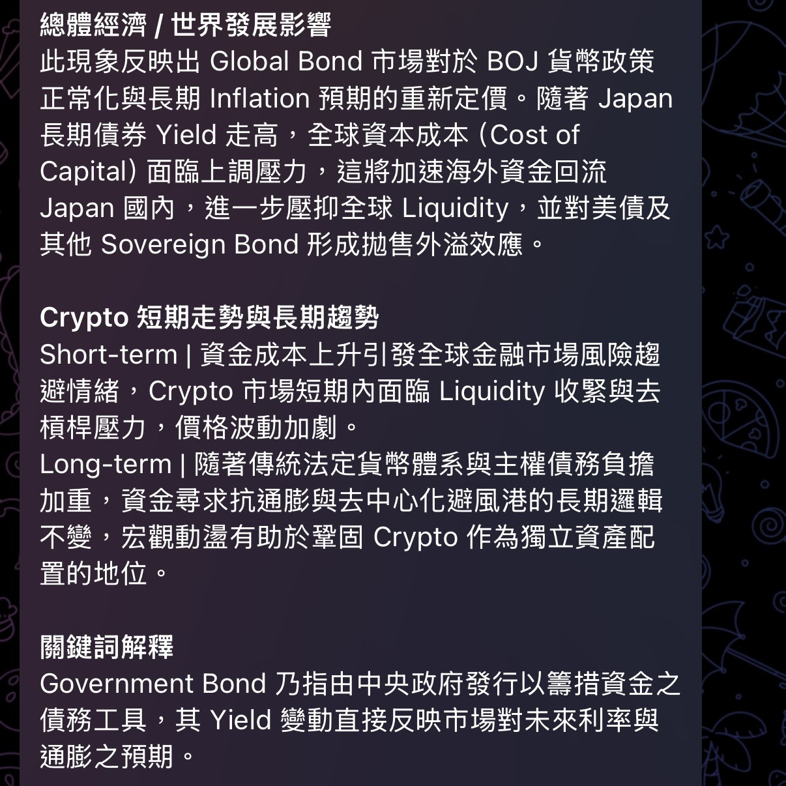

<div align="center">

# Jin10 News Scraper

**當市場還在睡，你已經先醒了。**

一個 24 小時盯著金十數據 WebSocket 的無伺服器助手，抓到使用者設定的關鍵字就丟給 Gemini 寫摘要，並即時推到你的 Telegram。

不用開網頁、不用刷群組、不用怕漏消息。

[](.)
[](.)
[](.)
[](.)
[](LICENSE)

</div>

<div align="center">
<table>
<tr>
<td align="center" width="33%">
<br>
<sub><b>即時地緣政治</b><br>情勢驟變，即時拆解對能源與 Crypto 市場的連鎖反應</sub>
</td>
<td align="center" width="33%">
<br>
<sub><b>央行政策外溢</b><br>BOJ 政策正常化如何牽動全球流動性與美債拋壓</sub>
</td>
<td align="center" width="33%">
<br>
<sub><b>產業數據解讀</b><br>電池產銷月度波動，串起 Clean Energy 與 Crypto 資金面</sub>
</td>
</tr>
</table>
</div>

## 這是什麼

金十快訊每天丟出成百上千條消息，九成是雜訊。這支腳本直接接上金十的 WebSocket 私有協定，逐條解析，**只在命中你關心的關鍵字時**才動作：丟給 Gemini 只提供你在乎的東西，然後自動並即時推到 Telegram。

沒有輪詢、沒有延遲、沒有伺服器帳單 —— 全部跑在 GitHub Actions 上，完全免費、常駐、自動重啟。

你只需要等手機通知就好。


## 為什麼值得看一眼

- **不是爬蟲，是真連線** — 逆向了金十的二進位 WebSocket 協定（XOR 加密、自訂封包格式），不是慢半拍的 RSS 或輪詢 API。
  
- **關鍵字即戰力** — 內建一份橫跨地緣政治、央行動向、大宗商品、加密貨幣的關鍵字庫，開箱即用；也可以丟一個 `.txt` 完全自訂。
  
- **不是翻譯，是簡報** — Gemini 做得不是「翻譯」，而是一套人設化的 Prompt（像是 Iron man 中的 Jarvis），輸出總體經濟影響、幣圈短長期走勢、關鍵詞解釋，結構化到可以直接看。
  
- **零基礎設施** — 沒有資料庫、沒有雲端主機、沒有 Docker。整套系統就是一個 `.py` 檔加一個 workflow 檔。
  
- **自癒式常駐** — 斷線自動重連；GitHub Actions 逾時前自動收尾，下一輪排程無縫接上，理論上可以 7×24 小時不中斷。


## 運作方式

```
金十 WebSocket ──▶ 解析二進位封包 ──▶ 關鍵字比對

                                          │ 命中
                                          ▼

                                    Gemini 摘要生成

                                          │
                                          ▼

                                   Telegram 即時推播
```

整個流程跑在單一個 GitHub Actions job 裡，靠 cron 排程每 6 小時重啟一次，中途斷線也會在腳本層自動重連，不需要人工介入。


## 快速開始

### 1. Fork / Clone 這個 repo

### 2. 設定 Secrets

到 repo 的 `Settings → Secrets and variables → Actions`，加入：

| Secret 名稱 | 說明 |
|---|---|
| `GEMINI_API_KEY` | Google AI Studio 的 Gemini API Key |
| `TELEGRAM_BOT_TOKEN` | 用 [@BotFather](https://t.me/BotFather) 建立的機器人 Token |
| `TELEGRAM_CHAT_ID` | 要接收推播的頻道 / 群組 / 個人 Chat ID |

### 3.（可選）自訂關鍵字

新增一個純文字檔，一行一個關鍵字，並在 workflow 裡設定 `KEYWORDS_FILE` 環境變數指向它。留空 = 使用內建關鍵字庫。

### 4. 打開 Actions

Fork 完成後到 `Actions` 分頁手動點一次 `workflow_dispatch`，或等排程自動觸發。第一次啟動時腳本會先驗證 Gemini 金鑰是否有效，並在 log 裡告訴你結果。


## 環境變數一覽

| 變數 | 預設值 | 用途 |
|---|---|---|
| `TG_TOKEN` | — | Telegram Bot Token |
| `TG_CHAT_ID` | — | 推播目標 Chat ID |
| `GEMINI_API_KEY` | — | Gemini API 金鑰 |
| `GEMINI_MODEL` | `gemini-3.5-flash-lite` | 使用的模型 |
| `KEYWORDS_FILE` | 空 | 自訂關鍵字清單路徑，留空用內建關鍵字庫 |
| `WS_URLS` | `wss://wss-flash-2.jin10.com/` | 金十 WebSocket 端點，可用逗號填多個做輪替 |
| `WS_IDLE_TIMEOUT` | `180` | 幾秒沒收到訊息就視為斷線並重連 |
| `WS_RECONNECT_DELAY` | `5` | 重連前的等待秒數 |


## 免責聲明

本專案僅供技術學習與個人資訊整理用途，抓取的內容版權歸金十數據所有，AI 生成的分析僅為機器摘要，**不構成任何投資建議**。市場有風險，決策前請自行查證。


<div align="center">

如果這東西幫你省下了滑手機找消息的時間，給顆星吧

</div>
