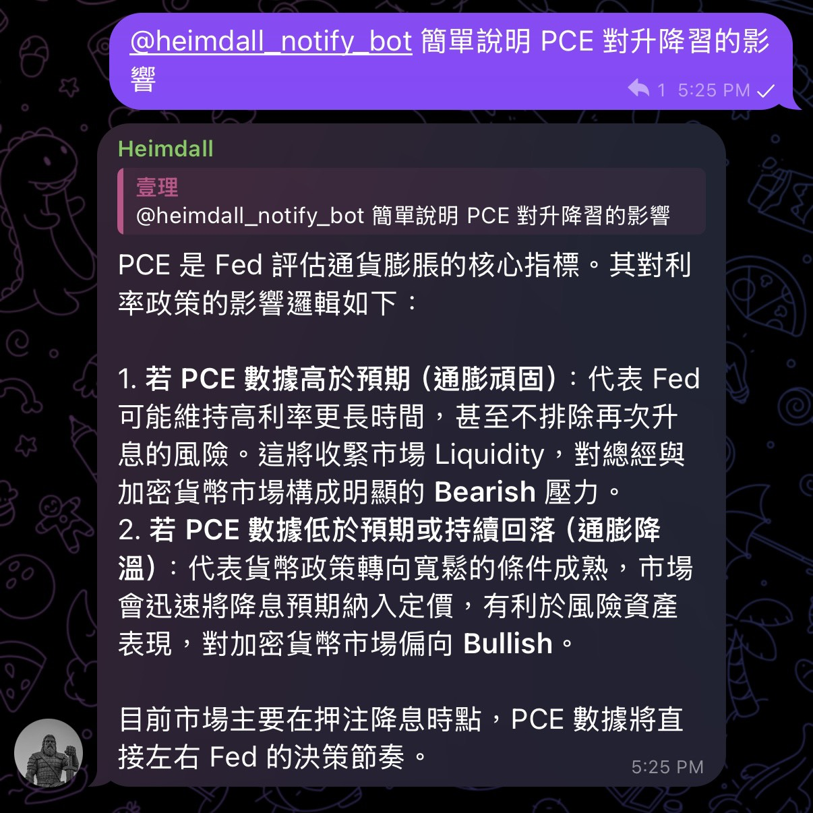

<div align="center">

# Jin10 News Scraper

**完全免費 x 持續開發中**

一個 24 小時盯著金十數據 WebSocket 的無伺服器助手，新聞命中關鍵字就丟給 Gemini 寫摘要 (關鍵字可自己設定)，並即時推到你的 Telegram；你也可以直接在 Telegram 裡問它問題，它會結合近期監控到的快訊回答你。

Github Action 24/7 自動化運行，可在群組與私訊正常運作

[](.)
[](.)
[](.)
[](.)
[](LICENSE)

**[English](README.en.md) | 繁體中文**

</div>

<div align="center">
<table>
<tr>
<td align="center" width="33%">
<br>
<sub><b>分級推播</b><br>Gemini 會根據新聞進行分級</sub>
</td>
<td align="center" width="33%">
<br>
<sub><b>AI 即時回覆</b><br>發送過的新聞 x 自身推理能力</sub>
</td>
</tr>
</table>
</div>

## 這是什麼

金十快訊每天丟出成百上千條消息，九成是雜訊。這支腳本直接接上金十的 WebSocket 私有協定，逐條解析，**只在命中你關心的關鍵字時**才動作：丟給 Gemini 只提供你在乎的東西，然後自動並即時推到 Telegram。

沒有輪詢、沒有延遲、沒有伺服器帳單 —— 全部跑在 GitHub Actions 上，完全免費、常駐、自動重啟。

你只需要等手機通知就好——如果通知不夠，還可以直接在 Telegram 裡追問它，例如「這則消息對 BTC 短期有什麼影響」，它會參考自己近期監控到的快訊背景，給你一段補充分析。


## 為什麼值得看一眼

- **不是爬蟲，是真連線** — 逆向了金十的二進位 WebSocket 協定（XOR 加密、自訂封包格式），不是慢半拍的 RSS 或輪詢 API。
  
- **關鍵字即戰力** — 內建一份橫跨地緣政治、央行動向、大宗商品、加密貨幣的關鍵字庫，開箱即用；也可以丟一個 `.txt` 完全自訂。
  
- **不是翻譯，是簡報** — Gemini 做得不是「翻譯」，而是一套人設化的 Prompt（像是 Iron man 中的 Jarvis），輸出總體經濟影響、幣圈短長期走勢、關鍵詞解釋，結構化到可以直接看。

- **不只推播，還能問** — 另外一支 `telegram_qa.py` 讓你直接在 Telegram 裡對機器人提問，它會帶入近幾小時監控到的快訊當背景資訊再回答，私訊免 @，群組打 `@你的機器人帳號 簡單說明 PCE 對升降息的影響` 或用 `/ask` 指令即可（如上圖範例）。與監控腳本各自獨立行程，互不干擾。
  
- **零基礎設施** — 沒有資料庫、沒有雲端主機、沒有 Docker。整套系統就是一個 `.py` 檔加一個 workflow 檔。
  
- **自癒式常駐** — 斷線自動重連；GitHub Actions 逾時前自動收尾，下一輪排程無縫接上，理論上可以 7×24 小時不中斷。


## 運作方式

```
金十 WebSocket ──▶ 解析二進位封包 ──▶ 關鍵字比對

                                          │ 命中
                                          ▼
                                    Gemini 分級 + 摘要 + 過濾

                                          │
                              ┌───────────┴───────────┐
                              ▼                        ▼
                       Telegram 即時推播      寫入 recent_news.json

                                                        │
                                                        ▼
                                          telegram_qa.py 無間段在背景運行

                                                        │
                        Telegram 訊息 ──▶ 判斷是否為提問 ──▶ Gemini 回答 ──▶ 回覆訊息
```

`jin10_monitor.py`（監控 + 推播）跑在單一個 GitHub Actions job 裡，靠 cron 排程每 6 小時重啟一次，中途斷線也會在腳本層自動重連，不需要人工介入。

### 兩個獨立行程

專案拆成兩支互相獨立、可以分開部署 / 分開重啟的腳本：

| 腳本 | 負責什麼 | 觸發方式 |
|---|---|---|
| `jin10_monitor.py` | 連上金十 WebSocket、關鍵字比對、Gemini 分級摘要、推播到 Telegram | 常駐運行 |
| `telegram_qa.py` | 輪詢 Telegram `getUpdates`，判斷訊息是不是在問問題，呼叫 Gemini 回覆 | 常駐運行 |

兩者透過同一份 `recent_news.json`（`NEWS_CONTEXT_FILE`）交換「近期快訊」：`jin10_monitor.py` 每次判定完快訊就把近期紀錄寫進這個檔案，`telegram_qa.py` 回答問題前會讀取它組成背景上下文。只要兩支腳本讀寫同一份檔案（同一台機器 / 同一個持久化儲存），即使其中一支重啟或暫時掛掉，也不影響另一支運作；`telegram_qa.py` 找不到這份檔案時仍會照常回答，只是不帶近期快訊背景。


## 快速開始

### 1. Fork / Clone 這個 repo

### 2. 設定 Secrets

到 repo 的 `Settings → Secrets and variables → Actions`，加入：

| Secret 名稱 | 說明 |
|---|---|
| `GEMINI_API_KEY` | Google AI Studio 的 Gemini API Key |
| `TELEGRAM_BOT_TOKEN` | 用 [@BotFather](https://t.me/BotFather) 建立的機器人 Token |
| `TELEGRAM_CHAT_ID` | 要接收推播的頻道 / 群組 / 個人 Chat ID |

### 3.（可選）自訂關鍵字

新增一個純文字檔，一行一個關鍵字，並在 workflow 裡設定 `KEYWORDS_FILE` 環境變數指向它。留空 = 使用內建關鍵字庫。

### 4. 打開 Actions

Fork 完成後到 `Actions` 分頁手動點一次 `workflow_dispatch`，或等排程自動觸發。第一次啟動時腳本會先驗證 Gemini 金鑰是否有效，並在 log 裡告訴你結果。

### 5.（可選）啟用 Telegram 問答

如果想在 Telegram 裡直接問機器人問題，另外啟動 `telegram_qa.py`（可以用同一組 Secrets，額外開一個 job / 排程，或找一台能常駐跑 Python 的機器）。它跟監控腳本是兩個獨立行程，分開重啟互不影響；只要兩者能讀寫同一份 `recent_news.json`，問答時就會自動帶入近期監控到的快訊背景。


## 環境變數一覽

### 共用（兩支腳本都會讀）

| 變數 | 預設值 | 用途 |
|---|---|---|
| `TELEGRAM_BOT_TOKEN` | — | Telegram Bot Token |
| `TELEGRAM_CHAT_ID` | — | 推播目標 / 允許問答的 Chat ID（`telegram_qa.py` 留空則不限制來源聊天） |
| `GEMINI_API_KEY` | — | Gemini API 金鑰 |
| `GEMINI_MODEL` | `gemini-3.5-flash-lite` | 使用的模型 |
| `NEWS_CONTEXT_FILE` | `recent_news.json` | 兩支腳本交換「近期快訊」的共用檔案路徑 |
| `CONTEXT_MAX_AGE_SEC` | `21600`（6 小時） | 近期快訊保留多久，超過就不再納入問答背景 |

### `jin10_monitor.py` 專屬

| 變數 | 預設值 | 用途 |
|---|---|---|
| `MAX_TIER_TO_SEND` | `MEDIUM` | 推播門檻，Gemini 判定的重要性等於或高於此級別才會推送（`CRITICAL`/`HIGH`/`MEDIUM`/`LOW`） |
| `KEYWORDS_FILE` | 空 | 自訂關鍵字清單路徑，留空用內建關鍵字庫 |
| `WS_URLS` | `wss://wss-flash-2.jin10.com/` | 金十 WebSocket 端點，可用逗號填多個做輪替 |
| `WS_IDLE_TIMEOUT` | `180` | 幾秒沒收到訊息就視為斷線並重連 |
| `WS_RECONNECT_DELAY` | `5` | 重連前的等待秒數 |
| `CONTEXT_MAX_ITEMS` | `80` | 近期快訊上下文檔最多保留幾則 |

### `telegram_qa.py` 專屬

| 變數 | 預設值 | 用途 |
|---|---|---|
| `CONTEXT_SNIPPET_LIMIT` | `40` | 回答問題時最多帶入幾則近期快訊當背景 |


## 免責聲明

本專案僅供技術學習與個人資訊整理用途，抓取的內容版權歸金十數據所有，AI 生成的分析僅為機器摘要，**不構成任何投資建議**。市場有風險，決策前請自行查證。


<div align="center">

<b>如果這東西幫你省下了滑手機找消息的時間，給顆星吧</b>

</div>