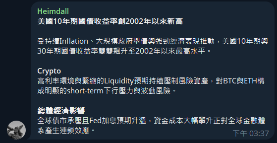
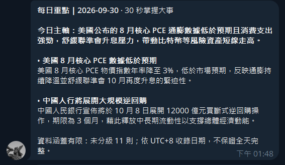
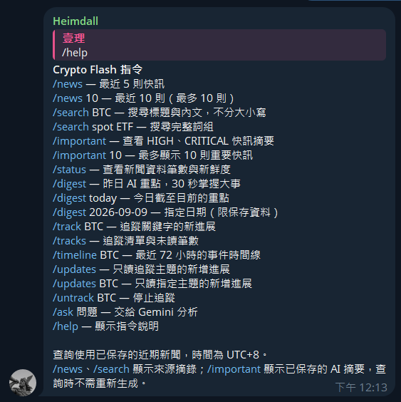

# Crypto Flash

**A self-hosted Python pipeline that filters real-time market news, uses Gemini to rank and summarize high-impact events, and delivers the result to Telegram.**

[Output demo](docs/demo.md) · [繁體中文文件](docs/README.md) · [Full English documentation](docs/README.en.md) · [Daily digest behavior](docs/daily-digest.md)

[](https://github.com/Yili-code/Crypto-Flash/actions/workflows/ci.yml)
[](https://www.python.org/)

## Why it exists

Crypto markets produce more updates than a person can evaluate in real time. Crypto Flash is built for the minutes-level window: ingest continuously, remove low-value noise, add concise context, and deliver the result where a small community already talks.

This is different from [News Agent](https://github.com/Yili-code/News-Agent), which produces a daily software, AI, and startup briefing. The two systems have different audiences, sources, and latency requirements.

Crypto Flash is for developers and market researchers who want a personal crypto and macro news monitor without operating a separate server. It is not a trading system, price feed, or investment-advice service.

## Operating context

The maintainer's instance has operated for about two months in a 10-member Telegram group as of October 2026. Improvements are currently maintainer-led: the maintainer proposes changes, discusses their value with the group, and refines the delivery format.

This is evidence that the system is being operated in a real group, not a claim that all 10 members are active users or that product-market fit has been established.

### Telegram product surfaces

The same pipeline supports three different time horizons:

- **Minutes:** turn a high-impact event into concise crypto and macro context.
- **Daily:** compress the day's important developments into a 30-second briefing.
- **On demand:** search recent news, inspect important summaries, track topics, review timelines, and ask Gemini questions from Telegram.

<table>
  <tr>
    <td width="50%"></td>
    <td width="50%"></td>
  </tr>
  <tr>
    <td><strong>Event impact</strong><br>Immediate context for a market-moving signal.</td>
    <td><strong>Daily digest</strong><br>A short briefing across the day's important events.</td>
  </tr>
</table>

<p align="center">
  
</p>

<p align="center"><strong>Query and tracking interface</strong><br>Recent context remains searchable and can be followed by topic.</p>

[See what these screenshots prove, what they do not prove, and how to reproduce the output.](docs/demo.md)

## What it does

- Ingests Jin10 WebSocket messages and configurable HTTPS RSS/Atom feeds.
- Filters by built-in or user-supplied keywords before spending Gemini requests.
- Retains and delivers only `CRITICAL` and `HIGH` classified flashes; `MEDIUM` and `LOW` are discarded.
- Sends Telegram alerts, answers questions with recent monitored context, and exposes `/news`, `/search`, `/important`, `/digest`, and event-tracking commands.
- Monitors configured YouTube channels and sends a summary only after successful parsing; external claim verification may arrive later as a supplement.
- Runs locally or on the included GitHub Actions schedules, with persisted deduplication and delivery state.
- Exposes `/health` for persisted pipeline health, permanent Gemini blocks, and pending-work visibility.
- Includes offline tests for parsing, retries, back pressure, deduplication, Telegram commands, digests, event tracking, and Gemini recovery.

## How it works

```text
Jin10 WebSocket ─┐
Curated RSS/Atom ├─> normalize ─> keyword filter ─> bounded queue
                 │                                      │
YouTube RSS ─────┘                              Gemini classify/summarize
                                                        │
                                      archive context ─> Telegram
                                             │
                                  search, digest, tracking, Q&A
```

The bounded queue protects ingestion when downstream AI or Telegram calls slow down. Gemini outages pause summarized flash delivery instead of silently forwarding unreviewed content; unclassified matching items can still be retained as context. See the [complete operational behavior](docs/README.en.md) for retention windows, retry policy, and failure semantics.

## Quick start

Requirements: Python 3.12, a Telegram bot and target chat, and a Gemini API key for classification, summaries, and Q&A.

```bash
git clone https://github.com/Yili-code/Crypto-Flash.git
cd Crypto-Flash
python -m venv .venv
```

Activate the environment and install the dependencies:

```powershell
# Windows PowerShell
.\.venv\Scripts\Activate.ps1
python -m pip install -r requirements.txt
Copy-Item .env.example .env
```

```bash
# macOS / Linux
source .venv/bin/activate
python -m pip install -r requirements.txt
cp .env.example .env
```

Set these values in `.env`:

```env
TELEGRAM_BOT_TOKEN_01="your-telegram-bot-token"
TELEGRAM_CHAT_ID="your-chat-id"
GEMINI_API_KEY="your-gemini-api-key"
```

Then start the combined flash monitor and Telegram assistant:

```bash
python src/flash_service.py
```

For an always-on installation with private state outside Git, use the included container setup:

```bash
docker compose up -d flash
```

This stores runtime data in the gitignored `runtime-data/` directory. Run the optional YouTube worker from your scheduler with `docker compose --profile manual run --rm youtube`.

Before enabling delivery, you can validate the configured RSS/Atom sources without changing seen state or sending a Telegram message:

```bash
python src/feed_monitor.py
```

For YouTube monitoring, scheduled GitHub Actions, every Telegram command, and all environment variables, use the [English setup guide](docs/README.en.md) or [Traditional Chinese guide](docs/README.md).

## Operational boundaries

- GitHub Actions schedules can start late and the six-hour monitor jobs have restart gaps; this is not guaranteed 24/7 delivery.
- Source outages, upstream format changes, queue pressure, and AI-provider failures can delay or omit alerts.
- AI summaries may be incomplete or incorrect. Verify consequential claims against primary sources.
- State files under `data/` are committed by the workflows. Review repository visibility and stored content before deployment.
- GitHub Actions remains a compatibility deployment with restart gaps. The container path is the recommended boundary when command availability or private runtime state matters.
- Jin10 content remains the property of its source. Users are responsible for complying with upstream terms and applicable rules.

## Development

The test suite is designed to run without API keys or network access.

```bash
python -m pip install -r requirements-dev.txt
python -m ruff check .
python -m pytest
```

To report a reproducible problem or propose a focused change, open an [issue](https://github.com/Yili-code/Crypto-Flash/issues) and follow [CONTRIBUTING.md](CONTRIBUTING.md). Good first contributions include parser fixtures, failure-path tests, documentation corrections, and additional permitted RSS/Atom sources.

## License status

Released under the [MIT License](LICENSE).
