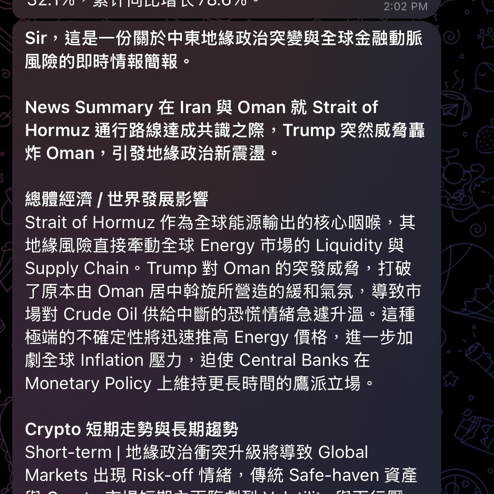

# Crypto Flash

An automated crypto-news monitoring system that filters high-volume market updates, uses Gemini to classify and summarize relevant events, and delivers actionable context through Telegram.

[繁體中文完整文件](docs/README.md) · [Full English documentation](docs/README.en.md)

## Why it exists

Crypto markets produce more updates than a person can evaluate in real time. Crypto Flash is built for the minutes-level window: ingest continuously, remove low-value noise, add concise context, and deliver the result where a small community already talks.

This is different from [News Agent](https://github.com/Yili-code/News-Agent), which produces a daily software, AI, and startup briefing. The two systems have different audiences, sources, and latency requirements.

## Operating context

The maintainer's instance has operated for about two months in a 10-member Telegram group as of October 2026. Improvements are currently founder-led: the maintainer proposes changes, discusses their value with the group, and refines the delivery format.

This is evidence that the system is being operated in a real group, not a claim that all 10 members are active users or that product-market fit has been established.

<p align="center">
  
</p>

## Engineering decisions

- Multi-source ingestion: Jin10 WebSocket plus curated crypto and official RSS feeds
- A bounded processing queue that protects ingestion under back pressure
- Gemini-based relevance grading, summaries, and background recovery
- Telegram delivery with throttling and rate-limit retries
- Searchable recent news, daily digests, and topic timelines
- YouTube RSS monitoring with persistent deduplication state
- Scheduled GitHub Actions with conflict-aware state persistence
- Offline unit tests that require no API keys or network access

## System flow

```text
Jin10 WebSocket ─┐
Curated RSS/Atom ├→ normalize → filter → bounded queue
                                  ↓
                         Gemini classify/summarize
                                  ↓
                  archive context → Telegram delivery
                         ↓
            search, digest, tracking, and Q&A
```

## Quick start

Requires Python 3.12 or newer.

```bash
git clone https://github.com/Yili-code/Crypto-Flash.git
cd Crypto-Flash
python -m venv .venv

# Windows PowerShell
.\.venv\Scripts\Activate.ps1

# macOS / Linux
# source .venv/bin/activate

python -m pip install -r requirements.txt
```

Copy `.env.example` to `.env`, add the Telegram and Gemini values you need, then run the combined monitor and assistant:

```bash
python src/flash_service.py
```

Individual services can also run independently. See the [complete setup guide](docs/README.en.md) for workflows, commands, environment variables, state retention, and operational caveats.

## Development checks

```bash
python -m pip install -r requirements-dev.txt
ruff check .
pytest
```

The CI workflow runs the same lint and test checks without secrets. Tests cover parsing, queue back pressure, retry behavior, deduplication, Telegram commands, digests, event tracking, and Gemini recovery.

## Important

AI-generated summaries are informational and may be incomplete or incorrect. This project is for technical learning and personal monitoring; it does not provide investment advice.
